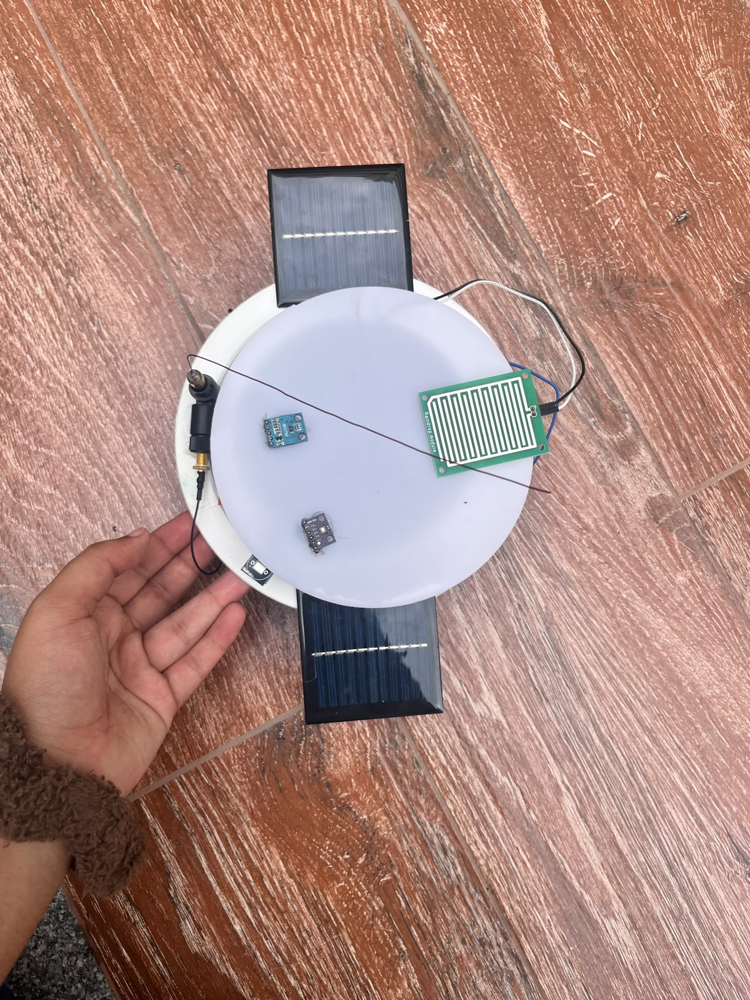
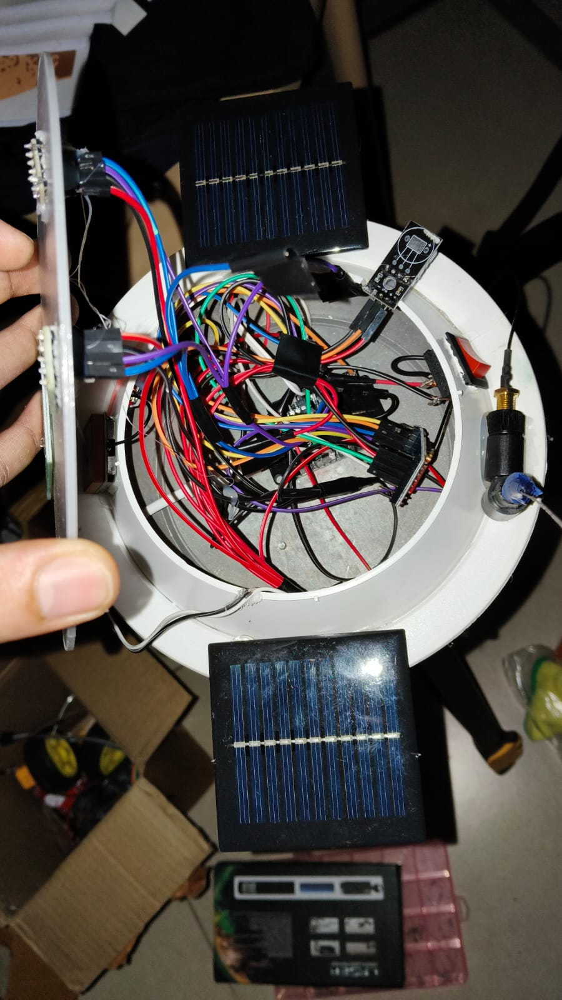
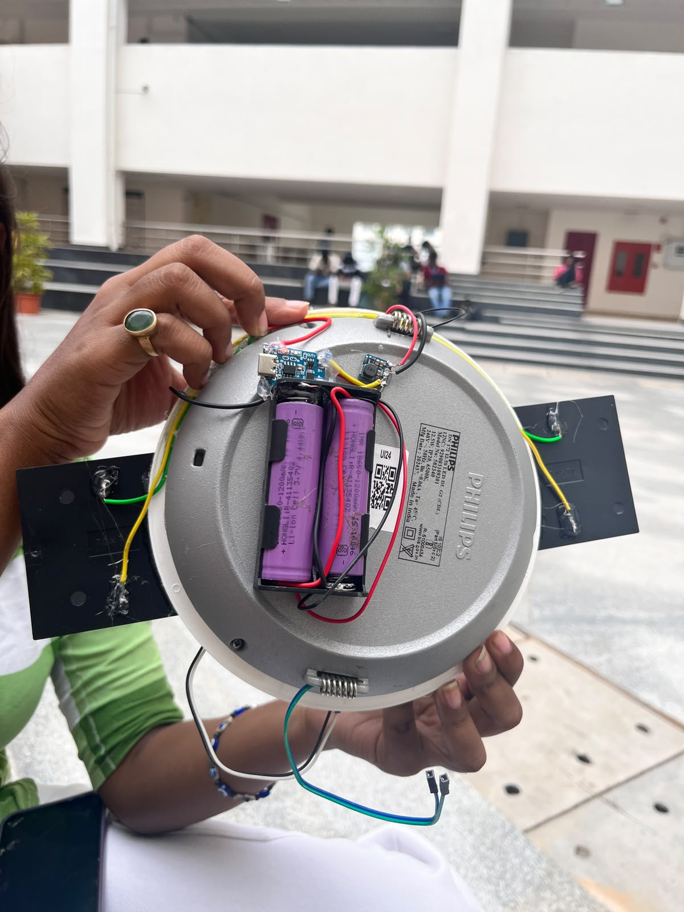
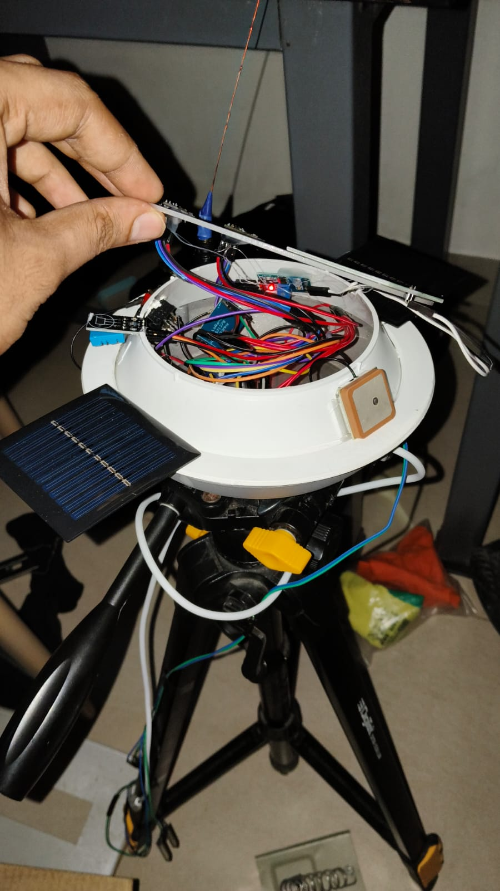
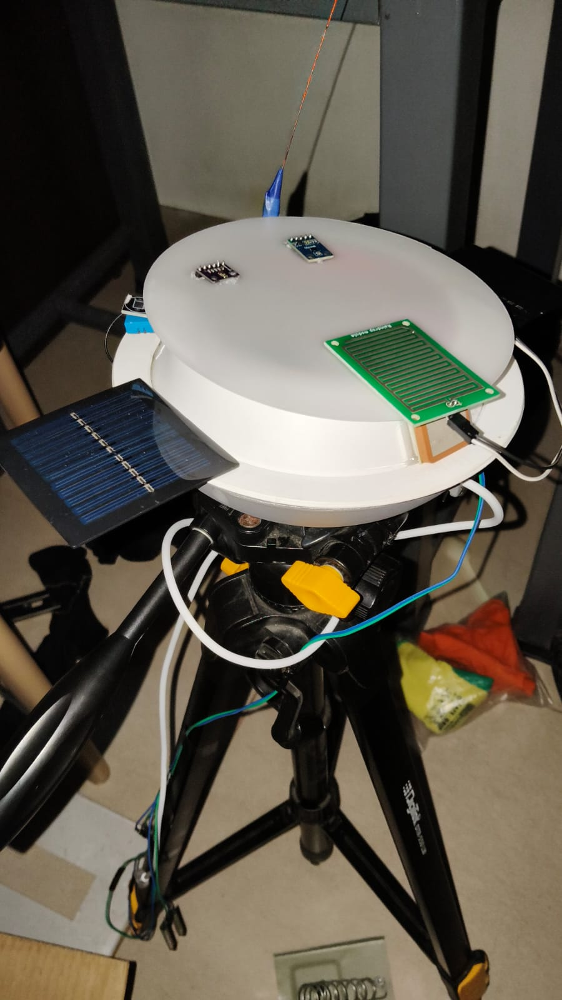
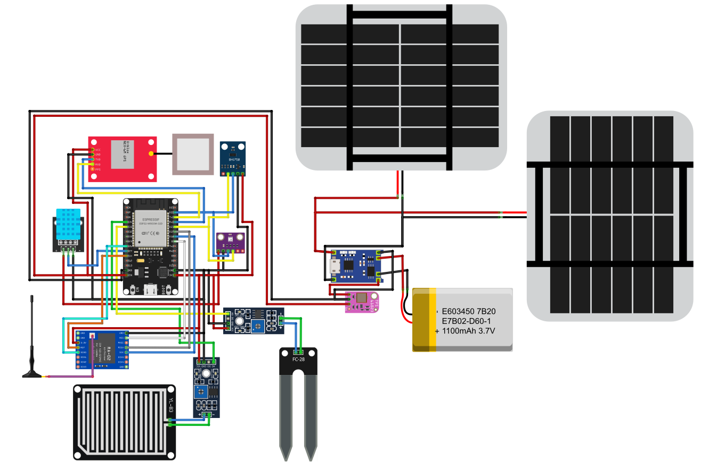

# Climatic Eye — Solar-Powered IoT Weather Station

An open-source, solar-powered environmental monitoring station built around the **ESP32** microcontroller. Climatic Eye collects real-time weather and soil data, transmits it wirelessly over **LoRa** (RA-02 433 MHz), and serves a live debug dashboard over Wi-Fi — all without requiring an internet connection.

**Author:** Krishna Singh



---

## Table of Contents

- [Features](#features)
- [Build Gallery](#build-gallery)
- [Hardware Components](#hardware-components)
- [Wiring and Pin Map](#wiring-and-pin-map)
- [Software Overview](#software-overview)
- [Getting Started](#getting-started)
- [Viewing the Schematic in Fritzing](#viewing-the-schematic-in-fritzing)
- [Repository Structure](#repository-structure)
- [Sensor Calibration](#sensor-calibration)
- [License](#license)
- [Contributing](#contributing)

---

## Features

- **Multi-sensor environmental monitoring** — temperature, humidity, barometric pressure, ambient light, rainfall, soil moisture, and GPS location.
- **LoRa long-range telemetry** — transmits JSON sensor packets via RA-02 (433 MHz) for remote data collection.
- **Solar-powered** — dual solar panels with Li-ion 18650 battery backup and TP4056 charge controller.
- **Built-in Wi-Fi dashboard** — the ESP32 hosts a responsive admin/debug web page accessible from any phone or laptop.
- **Self-contained operation** — creates its own Wi-Fi hotspot (AP mode) by default; optionally connects to an existing router (STA mode).
- **GPS geotagging** — each telemetry packet includes latitude, longitude, and satellite count from a NEO-6M GPS module.
- **Interpreted conditions** — firmware translates raw readings into human-readable states (e.g. "Comfortable", "Rain detected", "Overcast").

---

## Build Gallery









---

## Hardware Components

| Component | Purpose |
|---|---|
| ESP32 DevKit | Main microcontroller (Wi-Fi + BLE) |
| DHT11 | Temperature and humidity sensing |
| BMP280 | Barometric pressure and altitude |
| BH1750 | Ambient light intensity (lux) |
| Raindrop sensor (YL-83) | Rainfall detection (analog) |
| Soil moisture sensor (FC-28) | Soil moisture level (analog) |
| NEO-6M GPS | Latitude, longitude, and satellite tracking |
| RA-02 LoRa (SX1278) | 433 MHz long-range radio transmission |
| TP4056 charge module | Li-ion battery charging from solar input |
| 18650 Li-ion batteries (x2) | Rechargeable power supply |
| Solar panels (x2) | Energy harvesting |

---

## Wiring and Pin Map

### I2C Bus (BMP280 and BH1750)

| Signal | ESP32 GPIO |
|--------|-----------|
| SDA | GPIO 21 |
| SCL | GPIO 22 |

### NEO-6M GPS (UART2)

| Signal | ESP32 GPIO |
|--------|-----------|
| GPS TX | GPIO 16 (RX2) |
| GPS RX | GPIO 17 (TX2) |

### DHT11

| Signal | ESP32 GPIO |
|--------|-----------|
| DATA | GPIO 27 |

### Analog Sensors

| Signal | ESP32 GPIO |
|--------|-----------|
| Rain AO | GPIO 34 |
| Soil AO | GPIO 35 |

### RA-02 LoRa (SPI)

| Signal | ESP32 GPIO |
|--------|-----------|
| SCK | GPIO 18 |
| MISO | GPIO 19 |
| MOSI | GPIO 23 |
| NSS (CS) | GPIO 5 |
| RESET | GPIO 14 |
| DIO0 | GPIO 26 |

> A Fritzing schematic (`.fzz`) and exported wiring diagrams are available in the [`hardware/`](hardware/) folder. See [Viewing the Schematic in Fritzing](#viewing-the-schematic-in-fritzing) for installation instructions.



---

## Software Overview

### Firmware — [`ClimaticEye_Admin_Debug.ino`](software/ClimaticEye_Admin_Debug.ino)

The Arduino sketch performs the following operations:

1. **Sensor initialisation** — auto-detects BMP280 at address `0x76` or `0x77`, initialises BH1750, DHT11, GPS, and LoRa.
2. **Periodic reading** — samples all sensors every 5 seconds.
3. **JSON telemetry** — constructs a complete JSON payload containing raw values, interpreted states, and system status.
4. **LoRa transmission** — sends the JSON packet over 433 MHz LoRa.
5. **Wi-Fi web server** — serves the admin debug dashboard and exposes a `/api/data` JSON endpoint.
6. **Serial output** — prints formatted telemetry to the Serial Monitor at 115200 baud.

### Web Dashboard — [`index.html`](software/index.html)

A responsive, dark-themed, single-page dashboard that:

- Polls `/api/data` every 2 seconds.
- Displays live sensor readings with interpreted conditions.
- Shows system and sensor status (OK / FAILED) for each module.
- Provides raw ADC values and GPS coordinates.
- Includes a raw ESP32 diagnostic log panel.

### Required Arduino Libraries

| Library | Source |
|---|---|
| `WiFi` | Built-in (ESP32 core) |
| `WebServer` | Built-in (ESP32 core) |
| `Wire` / `SPI` | Built-in (Arduino core) |
| `Adafruit BMP280` | Adafruit BMP280 Library |
| `BH1750` | BH1750 by Christopher Laws |
| `DHT sensor library` | DHT sensor library by Adafruit |
| `TinyGPSPlus` | TinyGPSPlus by Mikal Hart |
| `LoRa` | LoRa by Sandeep Mistry |

---

## Getting Started

### 1. Clone the Repository

```bash
git clone https://github.com/<your-username>/climatic-eye-hw.git
```

### 2. Wire the Hardware

Follow the pin map above or refer to the [Climatic_Eye_Connection_Guide.pdf](hardware/Climatic_Eye_Connection_Guide.pdf) in the `hardware/` folder.

### 3. Flash the Firmware

1. Open [`software/ClimaticEye_Admin_Debug.ino`](software/ClimaticEye_Admin_Debug.ino) in the **Arduino IDE**.
2. Install the ESP32 board package and the required libraries listed above.
3. Select board: **ESP32 Dev Module**.
4. Set baud rate: **115200**.
5. Upload.

### 4. Access the Dashboard

By default the ESP32 creates a Wi-Fi hotspot with the following credentials:

| Setting | Value |
|---------|-------|
| SSID | `ClimaticEye-Debug` |
| Password | `climatic123` |
| Dashboard URL | `http://192.168.4.1` |

To connect to an existing router instead, set `STA_SSID` and `STA_PASSWORD` in the sketch before uploading. The ESP32 will attempt STA mode first and fall back to AP mode if the connection fails.

### 5. LoRa Frequency

The default LoRa frequency is **433 MHz** (`433E6`). If your RA-02 module operates at a different frequency, update the `LORA_FREQUENCY` constant in the sketch accordingly (e.g. `868E6` or `915E6`).

---

## Viewing the Schematic in Fritzing

The circuit schematic is provided as a [Fritzing](https://fritzing.org/) project file (`hardware/climatic-eye-schematic.fzz`). Fritzing is an open-source electronics design tool used to create breadboard layouts, schematics, and PCB designs.

### Installing Fritzing

1. Visit the official Fritzing download page: **[https://fritzing.org/download/](https://fritzing.org/download/)**
2. Fritzing is available for **Windows**, **macOS**, and **Linux**. Select the appropriate installer for your operating system.
3. Fritzing is distributed as a paid download (a small donation is requested to support ongoing development). Alternatively, the source code can be compiled from the [Fritzing GitHub repository](https://github.com/fritzing/fritzing-app).
4. Download and run the installer, or extract the portable archive to a directory of your choice.

### Opening the Schematic

1. Launch Fritzing.
2. Go to **File > Open** and navigate to `hardware/climatic-eye-schematic.fzz`.
3. The project will open in the **Breadboard** view. Use the tabs at the top to switch between **Breadboard**, **Schematic**, and **PCB** views.

Pre-exported wiring diagrams are also available as PNG images in the `hardware/` folder for those who prefer not to install Fritzing:

- [`full-view.png`](hardware/full-view.png) — complete circuit overview
- [`zoomed-esp32.png`](hardware/zoomed-esp32.png) — ESP32 wiring detail
- [`zoomed-power.png`](hardware/zoomed-power.png) — power circuit detail

---

## Repository Structure

```
climatic-eye-hw/
├── hardware/
│   ├── climatic-eye-schematic.fzz          # Fritzing schematic source file
│   ├── full-view.png                       # Full circuit diagram (exported)
│   ├── zoomed-esp32.png                    # ESP32 wiring detail (exported)
│   ├── zoomed-power.png                    # Power circuit detail (exported)
│   └── Climatic_Eye_Connection_Guide.pdf   # Printable wiring guide
├── software/
│   ├── ClimaticEye_Admin_Debug.ino         # ESP32 Arduino firmware
│   ├── index.html                          # Standalone web dashboard
│   └── setup-guide.png                     # Setup reference image
├── media/
│   ├── 1.jpeg                              # Build and prototype photographs
│   ├── 2.jpeg
│   ├── 3.jpeg
│   ├── 4.jpeg
│   └── 5.jpeg
└── readme.md
```

---

## Sensor Calibration

The raindrop and soil moisture sensors use analog ADC readings that must be calibrated for the specific modules in use. The default values in the firmware are as follows:

| Parameter | Default Value | Description |
|-----------|--------------|-------------|
| `RAIN_DRY_ADC` | 4095 | ADC reading when the rain sensor surface is dry |
| `RAIN_WET_ADC` | 1200 | ADC reading when the rain sensor surface is fully wet |
| `SOIL_DRY_ADC` | 3200 | ADC reading when the soil probe is in dry soil |
| `SOIL_WET_ADC` | 1400 | ADC reading when the soil probe is in saturated soil |

If the sensor readings are inverted (i.e. a wetter condition produces a higher ADC value), swap the DRY and WET values for the corresponding sensor.

---

## License

This project is open source. You are free to use, modify, and distribute it.

---

## Contributing

Contributions, bug reports, and feature requests are welcome. Please open an issue or submit a pull request.
